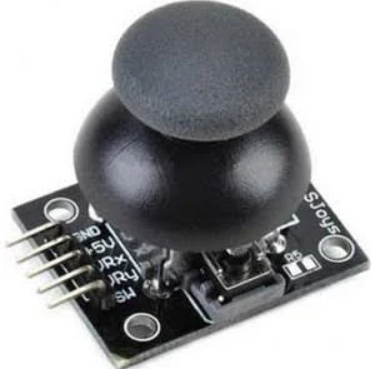

# STM32 JOYSTICK AND OLED

This project demonstrates the use of an analog joystick with an STM32 microcontroller to read analog values via ADC and display the data on an SSD1306 OLED screen. The display shows both the VRx/VRy values and directional arrow icons based on joystick movement.


*KY-023 Joystick*

## Hardware Components

- STM32F407VG (or compatible STM32 MCU)
- 2-axis analog joystick module (VRx, VRy, SW output)
- SSD1306 128x64 OLED display (I2C interface)
- Jumper wires / Breadboard

## Pin Connections

| Component      | STM32 Pins        |
|----------------|-------------------|
| Joystick VRx   | ADC1_IN0 (PA0)    |
| Joystick VRy   | ADC1_IN1 (PA1)    |
| Joystick SW    | PA2               |
| OLED SCL       | PB8 (I2C1_SCL)    |
| OLED SDA       | PB9 (I2C1_SDA)    |

> **Note:** ADC channels are configured as `ADC_CHANNEL_0` and `ADC_CHANNEL_1`. The joystick switch is read through `GPIOA PIN_2`.

## Software Description

The project uses STM32 HAL libraries and a third-party SSD1306 library. The main program loop performs the following tasks:

1. Starts ADC to read joystick's VRx and VRy values.
2. Reads the joystick's push button (SW) as digital input.
3. Displays the values and arrow icons on the OLED screen.
4. Directional thresholds are defined as follows:
   - VRx < 1000: Up
   - VRx > 3000: Down
   - VRy < 1000: Right
   - VRy > 3000: Left

## Libraries Used

- `ssd1306.h` - OLED display driver
- `fonts.h` - Font definitions
- `arrow.h` - Bitmap data for direction arrows

## File Structure

```
/OLED
    └── Src
        ├── ssd1306.c
        ├── fonts.c
    └── Inc
        ├── ssd1306.h
        ├── fonts.h 
        ├── arrow.h
```
<hr>

## Main Code 

```c
/* Private user code ---------------------------------------------------------*/
/* USER CODE BEGIN 0 */


#include "ssd1306.h"
#include "fonts.h"
#include "stdio.h"
#include "arrow.h"

char text_buff[50];


#define JoyStick_SW_GPIO 	GPIOA
#define JoyStick_SW_PIN  	GPIO_PIN_2

#define JoyStick_ADC 		&hadc1


typedef struct{
	uint16_t VRx;
	uint16_t VRy;
	uint8_t Switch;
}JoyStick;

JoyStick myJoyStick;

void Read_JoyStick()
{
	HAL_ADC_Start(JoyStick_ADC);
	HAL_ADC_PollForConversion(&hadc1, HAL_MAX_DELAY);
	myJoyStick.VRx = HAL_ADC_GetValue(JoyStick_ADC);
	HAL_ADC_PollForConversion(&hadc1, HAL_MAX_DELAY);
	myJoyStick.VRy = HAL_ADC_GetValue(JoyStick_ADC);
	HAL_ADC_Stop(JoyStick_ADC);
	myJoyStick.Switch = HAL_GPIO_ReadPin(JoyStick_SW_GPIO, JoyStick_SW_PIN);
}

void Write_OLED()
{
	SSD1306_GotoXY (10,10); // goto 10, 10
	sprintf (text_buff, "VRx: %04d", myJoyStick.VRx);
	SSD1306_Puts (text_buff, &Font_7x10, 1);
	SSD1306_GotoXY (10, 30);
	sprintf (text_buff, "VRy: %4d", myJoyStick.VRy);
	SSD1306_Puts (text_buff, &Font_7x10, 1);

	//******************************//----> ARROWS
	SSD1306_DrawFilledRectangle(100, 0, 32, 35, 0); //Draw Black Filled Rectangle for Up or Down
	SSD1306_DrawFilledRectangle(50, 40, 35, 32, 0); //Draw Black Filled Rectangle for Right or Left
	if(myJoyStick.VRx < 1000) SSD1306_DrawBitmap(100, 0, arrow_up, 32, 35, 1); 		//Up of Arrow
	if(myJoyStick.VRx > 3000) SSD1306_DrawBitmap(100, 0, arrow_down, 32, 35, 1); 	//Down of Arrow
	if(myJoyStick.VRy < 1000) SSD1306_DrawBitmap(50, 40, arrow_right, 35, 32, 1); 	//Right of Arrow
	if(myJoyStick.VRy > 3000) SSD1306_DrawBitmap(50, 40, arrow_left, 35, 32, 1); 	//Left of Arrow
    //******************************//

	SSD1306_UpdateScreen(); // update screen
}


/* USER CODE END 0 */
.
.
.
int main(void)
{
.
.
.
  /* USER CODE BEGIN 2 */

  SSD1306_Init (); // initialise the display
  SSD1306_Clear(); // clear display
  /* USER CODE END 2 */

  /* Infinite loop */
  /* USER CODE BEGIN WHILE */
  while (1)
  {
    /* USER CODE END WHILE */

    /* USER CODE BEGIN 3 */
		Read_JoyStick();

		Write_OLED();

		HAL_Delay(100);

  }
  /* USER CODE END 3 */
  .
  .
  .
```
<hr>

## License

This project is licensed under the MIT License. See the [LICENSE](LICENSE) file for details.
<hr>
## ✍️ Developer

**Semi Eren Gökyıldız**